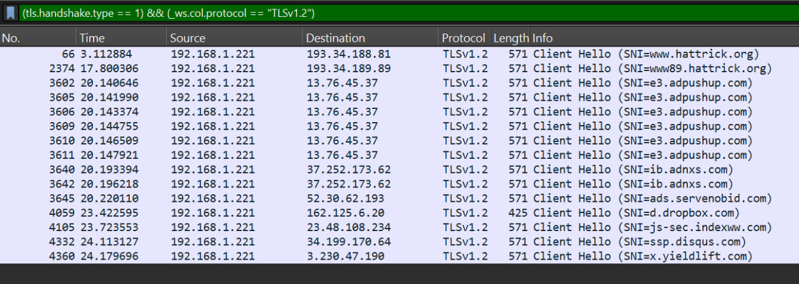
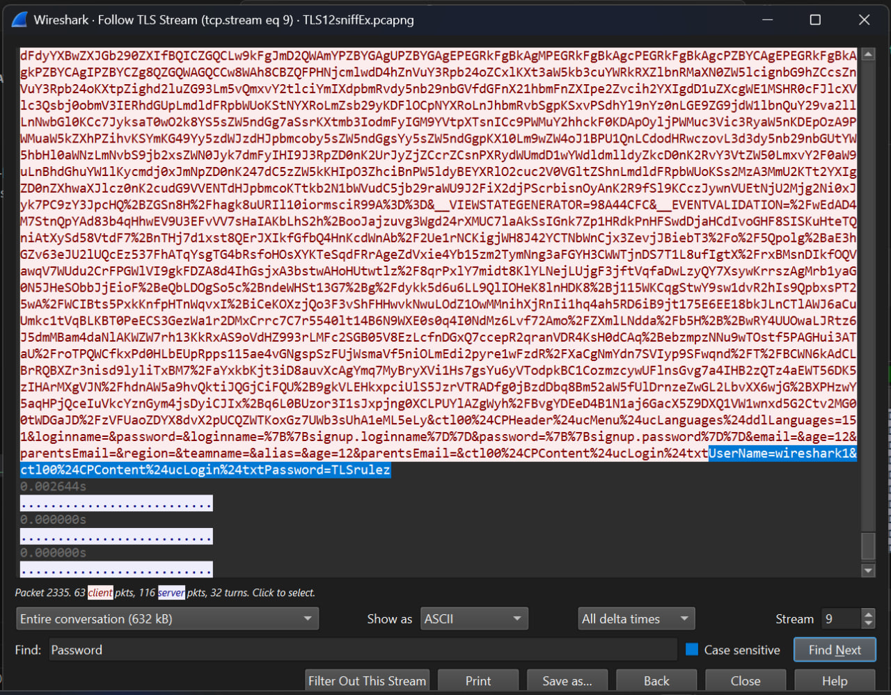

# TLS v1.2 Handshake Analysis using Wireshark

## I. TLS v1.2 Handshake

### 1. Counting Client Hello Packets
To find the number of packets containing `Client Hello`, use the following filter in Wireshark:
```
tls.handshake.type == 1 and _ws.col.protocol == "TLSv1.2"
```
This filter will display all packets where the handshake type is `Client Hello`.




### 2. Domain Name in First Client Hello
To determine the domain name, locate the first `Client Hello` packet and check the `Server Name Indication (SNI)` field under `Extensions`. This field contains the domain name being accessed.

```c
TLSv1.2 Record Layer: Handshake Protocol: Client Hello
    Content Type: Handshake (22)
    Version: TLS 1.0 (0x0301)
    Length: 512
    Handshake Protocol: Client Hello
        Handshake Type: Client Hello (1)
        Length: 508
        Version: TLS 1.2 (0x0303)
        Random: b9bdf1866b10cea7dac8676e9234afaf1a4898c9dfffa5c174aeb75a77599d22
        Session ID Length: 32
        Session ID: 13d0c147b2c2903711d940ae407423d2ec34cc95747318d94dfbb20c83dc799b
        Cipher Suites Length: 34
        Cipher Suites (17 suites)
        Compression Methods Length: 1
        Compression Methods (1 method)
        Extensions Length: n
        // server name
        Extension: server_name (len=21) name=www.hattrick.org
        .
        .
        .
```

### 3. Filtering for a Specific Server Name
To filter for `Client Hello` packets intended for a specific server name, use:
```
tls.handshake.extensions_server_name == "www.hattrick.org"
```

### 4. TLS Version
To identify the TLS version, inspect the `Client Hello` or `Server Hello` packet and check the `Version` field. For TLS 1.2, it should be:
```
TLS 1.2 (0x0303)
```

```c
TLSv1.2 Record Layer: Handshake Protocol: Client Hello
    Content Type: Handshake (22)
    Version: TLS 1.0 (0x0301)
    Length: 512
    Handshake Protocol: Client Hello
        Handshake Type: Client Hello (1)
        Length: 508
        // TLS Version
        Version: TLS 1.2 (0x0303)
        .
        .
        .
```

### 5. Cipher Suite and Algorithms
To find the selected cipher suite, check the `Server Hello` packet under `Cipher Suite`. The algorithms used are:

```c
TLSv1.2 Record Layer: Handshake Protocol: Multiple Handshake Messages
    Content Type: Handshake (22)
    Version: TLS 1.2 (0x0303)
    Length: 3844
    Handshake Protocol: Server Hello
        Handshake Type: Server Hello (2)
        Length: 90
        Version: TLS 1.2 (0x0303)
        Random: 634604551d9b9b7fb372db34c6c32315206b6a7ac8fc4dca525688fbdf5d4e99
        Session ID Length: 32
        Session ID: e6250000315d96db78bef8014ba84fa6c19ce27aa47353eae471141df4f6dc3a
        // Cipher Suite
        Cipher Suite: TLS_ECDHE_RSA_WITH_AES_256_GCM_SHA384 (0xc030)
```

- **Key Exchange**: `ECDHE_RSA` (Elliptic Curve Diffie-Hellman Ephemeral with RSA authentication)
  - Ensures forward secrecy by generating a unique session key for each session.

- **Encryption**: `AES_256_GCM` (Advanced Encryption Standard with a 256-bit key in Galois/Counter Mode)  
  - Provides strong encryption with authentication and integrity verification.

- **Hashing/Integrity**: `SHA384` (Secure Hash Algorithm with a 384-bit output)  
  - Used for message authentication and ensuring data integrity.

- **Authentication**: RSA-based certificate verification  
  - The server proves its identity using an RSA-based certificate signed by a trusted Certificate Authority (CA).

Each of these components ensures the confidentiality, integrity, and authenticity of the TLS session.


### 6. Server Certificates
To find the number of certificates sent by the server, check the `Certificate` message in the handshake. The `Common Name (CN)` can be found within each certificate's details.

```c
Handshake Protocol: Certificate
    Handshake Type: Certificate (11)
    Length: 3442
    Certificates Length: 3439
    Certificates (3439 bytes)
        // certificates 1 ICA
        Certificate Length: 1946
        Certificate […]: 308207963082057ea003020102021004f....
            signedCertificate
                version: v3 (2)
                serialNumber: 0x04f474c32e71498906b6dc88c8763dae
                signature (sha256WithRSAEncryption)
                issuer: rdnSequence (0)
                    rdnSequence: 3 items (id-at-commonName=GeoTrust .... )
                        RDNSequence item: 1 item (id-at-countryName=US)
                        RDNSequence item: 1 item (id-at-organizationName=DigiCert, Inc.)
                        // Common Name
                        RDNSequence item: 1 item (id-at-commonName=GeoTrust Global TLS RSA4096 SHA256 2022 CA1)
                validity
                subject: rdnSequence (0)
                subjectPublicKeyInfo
                extensions: 10 items
            algorithmIdentifier (sha256WithRSAEncryption)
            Padding: 0
            encrypted […]: 8fb84f5fadc11728316136b9b0871002a37fe8....
        Certificate Length: 1487
        // certificates 2 CA
        Certificate […]: 308205cb308204b3a00302010202100f62....
            signedCertificate
                version: v3 (2)
                serialNumber: 0x0f622f6f21c2ff5d521f723a1d47d62d
                signature (sha256WithRSAEncryption)
                issuer: rdnSequence (0)
                    rdnSequence: 4 items (id-at-commonName=DigiCert .... )
                        RDNSequence item: 1 item (id-at-countryName=US)
                        RDNSequence item: 1 item (id-at-organizationName=DigiCert Inc)
                        RDNSequence item: 1 item (id-at-organizationalUnitName=www.digicert.com)
                        // Common Name
                        RDNSequence item: 1 item (id-at-commonName=DigiCert Global Root CA)
                validity
                subject: rdnSequence (0)
                subjectPublicKeyInfo
                extensions: 8 items
            algorithmIdentifier (sha256WithRSAEncryption)
            Padding: 0
            encrypted […]: 9e72b5c051c70b735d6fd2dad3b2489bb86e11...
```

### 7. Certificate Validity for Other URLs
Check the `Subject Alternative Name (SAN)` field in the certificate details to see if other subdomains under `hattrick.org` are included.

```c
Handshake Protocol: Certificate
    Handshake Type: Certificate (11)
    Length: 3442
    Certificates Length: 3439
    Certificates (3439 bytes)
        Certificate Length: 1946
        // certificates 1 ICA
        Certificate […]: 308207963082057ea00302010202100....
            signedCertificate
                version: v3 (2)
                serialNumber: 0x04f474c32e71498906b6dc88c8763dae
                signature (sha256WithRSAEncryption)
                issuer: rdnSequence (0)
                validity
                subject: rdnSequence (0)
                subjectPublicKeyInfo
                extensions: 10 items
                    Extension (id-ce-authorityKeyIdentifier)
                    Extension (id-ce-subjectKeyIdentifier)
                    // Subject Alternative Name
                    Extension (id-ce-subjectAltName)
                        Extension Id: 2.5.29.17 (id-ce-subjectAltName)
                        GeneralNames: 2 items
                            GeneralName: dNSName (2)
                                dNSName: *.hattrick.org
                            GeneralName: dNSName (2)
                                // hattrick.org
                                dNSName: hattrick.org
                    Extension (id-ce-keyUsage)
                    Extension (id-ce-extKeyUsage)
                    Extension (id-ce-cRLDistributionPoints)
                    Extension (id-ce-certificatePolicies)
                    Extension (id-pe-authorityInfoAccess)
                    Extension (id-ce-basicConstraints)
                    Extension (SignedCertificateTimestampList)
            algorithmIdentifier (sha256WithRSAEncryption)
            Padding: 0
            encrypted […]: 8fb84f5fadc11728316136b9b0....
        Certificate Length: 1487
        // certificates 2 CA
        Certificate […]: 308205cb308204b3a00302010....
```

### 8. Certificate Validity Dates
The certificate’s validity range is found in the `Validity` field, showing the `Not Before` and `Not After` dates.

```c
Handshake Protocol: Certificate
    Handshake Type: Certificate (11)
    Length: 3442
    Certificates Length: 3439
    Certificates (3439 bytes)
        Certificate Length: 1946
        // certificates 1 ICA
        Certificate […]: 308207963082057ea00302010202....
            signedCertificate
                version: v3 (2)
                serialNumber: 0x04f474c32e71498906b6dc88c8763dae
                signature (sha256WithRSAEncryption)
                issuer: rdnSequence (0)
                // Validity
                validity
                    notBefore: utcTime (0)
                        // Not Before
                        utcTime: 2022-06-30 00:00:00 (UTC)
                    notAfter: utcTime (0)
                        // Not After
                        utcTime: 2023-07-15 23:59:59 (UTC)
                subject: rdnSequence (0)
                subjectPublicKeyInfo
                extensions: 10 items
            algorithmIdentifier (sha256WithRSAEncryption)
            Padding: 0
            encrypted […]: 8fb84f5fadc11728316136b9b08....
        Certificate Length: 1487
        // certificates 2 CA
        Certificate […]: 308205cb308204b3a0030201020....

```
### 9. Root Certificate Authority
The `Issuer` field in the certificate details shows the Root CA. To determine if its certificate was sent, verify if the full chain is included in the handshake.

```c
Handshake Protocol: Certificate
    Handshake Type: Certificate (11)
    Length: 3442
    Certificates Length: 3439
    Certificates (3439 bytes)
        Certificate Length: 1946
        // certificates 1 ICA
        Certificate […]: 308207963082057ea00302010....
        Certificate Length: 1487
        // certificates 2 CA
        Certificate […]: 308205cb308204b3a0030201020....
            signedCertificate
                version: v3 (2)
                serialNumber: 0x0f622f6f21c2ff5d521f723a1d47d62d
                signature (sha256WithRSAEncryption)
                // Issuer
                issuer: rdnSequence (0)
                    rdnSequence: 4 items (id-at-commonName=DigiCert  .... )
                        RDNSequence item: 1 item (id-at-countryName=US)
                        RDNSequence item: 1 item (id-at-organizationName=DigiCert Inc)
                        RDNSequence item: 1 item (id-at-organizationalUnitName=www.digicert.com)
                        // Root CA
                        RDNSequence item: 1 item (id-at-commonName=DigiCert Global Root CA)
                validity
                subject: rdnSequence (0)
                subjectPublicKeyInfo
                extensions: 8 items
            algorithmIdentifier (sha256WithRSAEncryption)
            Padding: 0
            encrypted […]: 9e72b5c051c70b735d6fd2dad3b24....
```

### 10. Certificate Revocation Check
TO DO

### 11. Additional Record Sent in Key Exchange
If key exchange uses `ECDHE`, the `Server Key Exchange` message is sent. This includes:
- Server's public key
- Elliptic curve parameters
- Digital signature for authentication

```c
Handshake Protocol: Server Key Exchange
    Handshake Type: Server Key Exchange (12)
    Length: 296
    EC Diffie-Hellman Server Params
        // Elliptic curve parameters
        Curve Type: named_curve (0x03)
        Named Curve: x25519 (0x001d)
        Pubkey Length: 32
        // Server's public key
        Pubkey: 0524cd7f90ce7b87cafa67994....
        // Digital signature for authentication
        Signature Algorithm: rsa_pkcs1_sha256 (0x0401)
        Signature Length: 256
        Signature […]: 899dc8db1b5e58545f5f804a312134d....
```

### 12. Client Key Exchange Handshake Type
Check the `Client Key Exchange` message under handshake messages. This packet contains the client's encrypted pre-master secret. The client does not sign it, as encryption ensures security.

```c
Handshake Protocol: Client Key Exchange
    Handshake Type: Client Key Exchange (16)
    Length: 33
    EC Diffie-Hellman Client Params
        Pubkey Length: 32
        // encrypted pre-master secret
        Pubkey: e440e2678bd4a3619447555de73ba6ff8d3d7ddb66958da7364a83a12ef49145
```

### 13. Selecting Correct TLS Session Key in Wireshark
Wireshark uses `Client Random` for selecting the correct key from the SSL log file.

```c
Handshake Protocol: Client Hello
    Handshake Type: Client Hello (1)
    Length: 508
    Version: TLS 1.2 (0x0303)
    // Client Random
    Random: b9bdf1866b10cea7dac8676e9234afaf1a4898c9dfffa5c174aeb75a77599d22
    .
    .
    .
```
The line in the sslkeylog_TLS12 file
```c
// Client Random
CLIENT_RANDOM b9bdf1866b10cea7dac8676e9234afaf1a4898c9dfffa5c174aeb75a77599d22 
//Master Secret
d56e64ec4c85711dac8ced1b6cdfef79f0ee95ba1bb28d95a6b25eac35f47c74b048d05e4bd32132dbcfa1fda6017561
```
### 14. First Resource Requested
The first `GET` request by the client can be found in the `HTTP` layer after decryption. Check the `Request URI` and `HTTP status code`. Based on the status code:
- `200 OK`: The resource was successfully retrieved.
- `301/302 Redirect`: The client will follow the redirect.
- `403/404`: The resource is unavailable or forbidden.

### 15. Searching for Username and Password
After following the `TLS Stream`, search for `username` and `password` in the decrypted data to locate authentication credentials.



```c
HyperText Transfer Protocol 2
    Stream: DATA, Stream ID: 129, Length 11454
    HTML Form URL Encoded: application/x-www-form-urlencoded

        .
        .
        .

        // username
        Form item: "ctl00$CPContent$ucLogin$txtUserName" = "wireshark1"
            Key: ctl00$CPContent$ucLogin$txtUserName
            Value: wireshark1
        // password
        Form item: "ctl00$CPContent$ucLogin$txtPassword" = "TLSrulez"
            Key: ctl00$CPContent$ucLogin$txtPassword
            Value: TLSrulez
```

---
This markdown document provides a structured approach to analyzing TLS 1.2 handshakes in Wireshark, covering packet filtering and key details in the handshake process.

