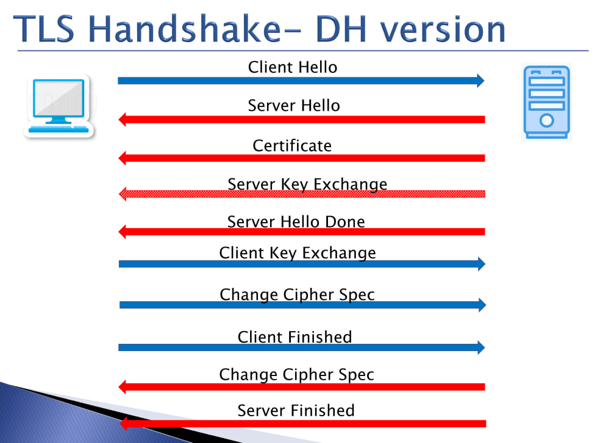

# TLS Handshake - Diffie-Hellman (DH) Version



## 1. Client Hello (→)
The client initiates the handshake by sending a **Client Hello** message to the server.

### Information Sent:
- Supported TLS version
- Randomly generated number (**Client Random**)
- Supported cipher suites (including DH key exchange options)
- Compression methods (if any)
- Extensions  

**Wireshark Filter:**
```plaintext
tls.handshake.type == 1
```

```c
TLSv1.2 Record Layer: Handshake Protocol: Client Hello
    Content Type: Handshake (22)
    Version: TLS 1.0 (0x0301)
    Length: 1957
    Handshake Protocol: Client Hello
        Handshake Type: Client Hello (1)
        Length: 1953
        // Supported TLS version
        Version: TLS 1.2 (0x0303)
        // Randomly generated number (**Client Random**)
        Random: ca9ce908ada6ec330af35eb6dfbfebaaf48844bbd5036e6a161d7e6ee20301a6
        Session ID Length: 32
        Session ID: ae4084040d603631e70888b77687c17e08d56a3993d9ee2757b89167f33b441f
        Cipher Suites Length: 32
        // Supported cipher suites (including DH key exchange options)
        Cipher Suites (16 suites)
        Compression Methods Length: 1
        Compression Methods (1 method)
        Extensions Length: n
        Extension: 1
        Extension: 2
        .
        .
        .
```

---

## 2. Server Hello (←)
The server responds with a **Server Hello** message.

### Information Sent:
- Selected TLS version
- Randomly generated number (**Server Random**)
- Chosen cipher suite

**Wireshark Filter:**
```plaintext
tls.handshake.type == 2
```

```c
TLSv1.2 Record Layer: Handshake Protocol: Server Hello
    Content Type: Handshake (22)
    Version: TLS 1.2 (0x0303)
    Length: 108
    Handshake Protocol: Server Hello
        Handshake Type: Server Hello (2)
        Length: 104
        // Selected TLS version
        Version: TLS 1.2 (0x0303)
        // Randomly generated number (**Server Random**)
        Random: 373f4b385d399db7a6f51e23ccce0998d9fc0334c61c820b56ffc3b5470a2785
        Session ID Length: 32
        Session ID: 6013c89ecd3954d047fa24c93a6653231de309eac5019ee1f004b802529cd320
        // Chosen cipher suite
        Cipher Suite: TLS_ECDHE_RSA_WITH_AES_128_GCM_SHA256 (0xc02f)
        Compression Method: null (0)
        Extensions Length: n
        Extension: 1
        Extension
        .
        .
        .
```

---

## 3. Server Key Exchange (←)
Since DH is used, the server sends its **Diffie-Hellman parameters** for key exchange.

### Information Sent:
- DH public parameters (P - prime number, G - generator, public key)
- Server's digital signature (to authenticate the key exchange)

**Wireshark Filter:**
```plaintext
tls.handshake.type == 12
```

```c
TLSv1.2 Record Layer: Handshake Protocol: Server Key Exchange
    Content Type: Handshake (22)
    Version: TLS 1.2 (0x0303)
    Length: 333
    Handshake Protocol: Server Key Exchange
        Handshake Type: Server Key Exchange (12)
        Length: 329
        EC Diffie-Hellman Server Params
            Curve Type: named_curve (0x03)
            Named Curve: secp256r1 (0x0017)
            Pubkey Length: 65
            // TO DO
            Pubkey: 04e16340192d2e7a06287338393b89ae....
            Signature Algorithm: rsa_pkcs1_sha256 (0x0401)
            Signature Length: 256
            // Server's digital signature
            Signature […]: 9b99b89b65725a0df47dd049c647bc5c57cdbf65e0d0....
```

---

## 4. Certificate (←)
The server sends its **digital certificate** (X.509 certificate) to authenticate its identity.

### Information Sent:
- Server's **public key** (not used for encryption in DH, only for authentication)
- Certificate issuer's information
- Digital signature from a trusted Certificate Authority (CA)

**Wireshark Filter:**
```plaintext
tls.handshake.type == 11
```


---

## 5. Server Hello Done (←)
The server signals that it has finished its part of the handshake.

**Wireshark Filter:**
```plaintext
tls.handshake.type == 14
```

---

## 6. Client Key Exchange (→)
The client responds by sending its **Diffie-Hellman public key** to complete the key exchange process.

### Information Sent:
- DH public parameters (public key from the client)

**Wireshark Filter:**
```plaintext
tls.handshake.type == 16
```

---

## 7. Change Cipher Spec (→)
The client informs the server that it will now switch to using the newly negotiated encryption algorithm and session key.

**Wireshark Filter:**
```plaintext
tls.change_cipher_spec
```

---

## 8. Client Finished (→)
The client sends a **Finished** message, encrypted with the session key, indicating that the handshake is complete from its side.

**Wireshark Filter:**
```plaintext
tls.handshake.type == 20
```

---

## 9. Change Cipher Spec (←)
The server also switches to the negotiated encryption method.

**Wireshark Filter:**
```plaintext
tls.change_cipher_spec
```

---

## 10. Server Finished (←)
The server sends a **Finished** message, also encrypted with the session key, confirming that the handshake is complete.

**Wireshark Filter:**
```plaintext
tls.handshake.type == 20
```

---

## Secure Communication Begins
At this point, both parties have established a secure, encrypted communication channel and can begin exchanging data securely.

---
