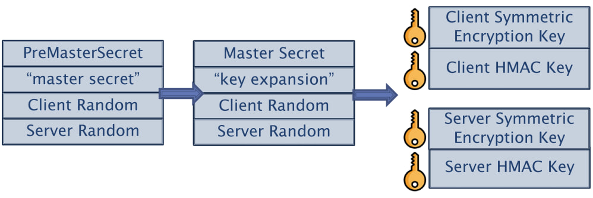
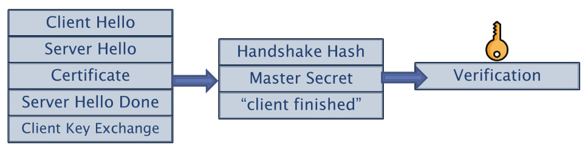

# TLS Handshake - RSA Version


## 1. Client Hello (→)
The client initiates the handshake by sending a **Client Hello** message to the server.

### Information Sent:
- Supported TLS version
- Randomly generated number (**Client Random**)
- Supported cipher suites (encryption algorithms)
- Compression methods (if any)
- Extensions 

**Wireshark Filter:**
```plaintext
tls.handshake.type == 1 
```
**The package:**
```c
TLSv1.2 Record Layer: Handshake Protocol: Client Hello
    Content Type: Handshake (22)
    Version: TLS 1.0 (0x0301)
    Length: 1825
    Handshake Protocol: Client Hello
        Handshake Type: Client Hello (1)
        Length: 1821
        // Supported TLS version
        Version: TLS 1.2 (0x0303)
        // Randomly generated number (**Client Random**)
        Random: 3cb0bde640c05b1e4f23f8de8a3ee8e713ed10b131bbdb7735ad1b9ccccac722
        Session ID Length: 32
        Session ID: feb6710f9c2b3b1edbc66f59a7bb1ee7241e77dfd257e18966ba314853525bfd
        // Supported cipher suites (encryption algorithms)
        Cipher Suites Length: 32
        Cipher Suites (16 suites)
        // Compression methods (if any)
        Compression Methods Length: 1
        Compression Methods (1 method)
        // Extensions 
        Extensions Length: n
        Extension: 1 
        Extension: 2 
        .
        .
        .
```

---

## 2. Server Hello (←)
The server responds with a **Server Hello** message.

### Information Sent:
- Selected TLS version
- Randomly generated number (**Server Random**)
- Chosen cipher suite

**Wireshark Filter:**
```plaintext
tls.handshake.type == 2
```

```c
TLSv1.2 Record Layer: Handshake Protocol: Server Hello
    Content Type: Handshake (22)
    Version: TLS 1.2 (0x0303)
    Length: 72
    Handshake Protocol: Server Hello
        Handshake Type: Server Hello (2)
        Length: 68
        // Selected TLS version
        Version: TLS 1.2 (0x0303)
        // Randomly generated number (**Server Random**)
        Random: 06c1a13d2d62d43d792b202b1f62c1705f95b9b3869643c61a7e0ddfc01fdb30
        Session ID Length: 0
        // Chosen cipher suite
        Cipher Suite: TLS_RSA_WITH_AES_256_GCM_SHA384 (0x009d)
        Compression Method: null (0)
        Extensions Length: n
        Extension: 1
        Extension: 2
        .
        .
        .


```
---

## 3. Certificate (←)
The server sends its **digital certificate** (X.509 certificate).

### Information Sent:
- Server's **public key**
- Certificate issuer's information
- Digital signature from a trusted Certificate Authority (CA)

The client verifies this certificate to ensure the server is legitimate.

**Wireshark Filter:**
```plaintext
tls.handshake.type == 11
```

```c
TLSv1.2 Record Layer: Handshake Protocol: Certificate
    Content Type: Handshake (22)
    Version: TLS 1.2 (0x0303)
    Length: 2984
    Handshake Protocol: Certificate
        Handshake Type: Certificate (11)
        Length: 2980
        Certificates Length: 2977
        Certificates (2977 bytes)
            // My certificate from ICA
            Certificate Length: 1753
            Certificate […]: 308206d5308205bda00302010202....
            // The ICA certificate from the root CA
            Certificate Length: 1218
            Certificate […]: 308204be308203a6a00302010202....
```

```c
TLSv1.2 Record Layer: Handshake Protocol: Certificate
    Content Type: Handshake (22)
    Version: TLS 1.2 (0x0303)
    Length: 2984
    Handshake Protocol: Certificate
        Handshake Type: Certificate (11)
        Length: 2980
        Certificates Length: 2977
        Certificates (2977 bytes)
            // My certificate from ICA
            Certificate Length: 1753
            Certificate […]: 308206d5308205bda00302010202....
                signedCertificate
                    version: v3 (2)
                    serialNumber: 0x0d448bae7735bd100b1aa5c1035d09c0
                    // Digital signature from the ICA
                    signature (sha256WithRSAEncryption)
                    // Who gives the certificate (ICA)
                    issuer: rdnSequence (0)
                    // The certificate is valid between dates
                    validity
                    // To whom is the certificate given (the server)
                    subject: rdnSequence (0)
                    // Server's public key RSA
                    subjectPublicKeyInfo
                        algorithm (rsaEncryption)
                        subjectPublicKey […]: 3082010a02820101009a5543b94420....
                            // N 
                            modulus: 0x009a5543b94420d017e811d5a0aff79155....
                            // E
                            publicExponent: 65537
                    extensions: 10 items
                algorithmIdentifier (sha256WithRSAEncryption)
                Padding: 0
                encrypted […]: 2d643fa6df4af908ba4bdc3517d6c046e....
            // In general, it is similar, you just need to make sure that the certificate 
            // sequence is not broken, meaning that its "subject" is equal to the "issuer"
            //  of the previous one above.
            Certificate Length: 1218
            Certificate […]: 308204be308203a6a00302010202....

```
---

## 4. Server Hello Done (←)
The server sends a **Server Hello Done** message to indicate it has completed its part of the handshake.

**Wireshark Filter:**
```plaintext
tls.handshake.type == 14
```

```c
Transport Layer Security
    TLSv1.2 Record Layer: Handshake Protocol: Server Hello Done
        Content Type: Handshake (22)
        Version: TLS 1.2 (0x0303)
        Length: 4
        Handshake Protocol: Server Hello Done
            Handshake Type: Server Hello Done (14)
            Length: 0

```
---

## 5. Client Key Exchange (→)
The client generates a **Pre-Master Secret**, encrypts it with the server's **public key** (from the certificate), and sends it to the server.

### Information Sent:
- Encrypted **Pre-Master Secret**

This secret is used to generate the session key.
This is the shared secret encrypted with RSA.

**Wireshark Filter:**
```plaintext
tls.handshake.type == 16
```

```c
TLSv1.2 Record Layer: Handshake Protocol: Client Key Exchange
    Content Type: Handshake (22)
    Version: TLS 1.2 (0x0303)
    Length: 262
    Handshake Protocol: Client Key Exchange
        Handshake Type: Client Key Exchange (16)
        Length: 258
        RSA Encrypted PreMaster Secret
            Encrypted PreMaster length: 256
            //Encrypted Pre-Master Secret
            Encrypted PreMaster […]: 72de63a3f61451f7efbe006923ff1a7d22b2....

```


---

## 6. Change Cipher Spec (→)
The client informs the server that it will now switch to using the newly negotiated encryption algorithm and session key.

**Wireshark Filter:**
```plaintext
tls.change_cipher_spec
```

```plaintext
TLSv1.2 Record Layer: Change Cipher Spec Protocol: Change Cipher Spec
    Content Type: Change Cipher Spec (20)
    Version: TLS 1.2 (0x0303)
    Length: 1
    Change Cipher Spec Message
```
---

## 7. Client Finished (→)
The client sends a **Finished** message, encrypted with the session key, indicating that the handshake is complete from its side.

**Wireshark Filter:**
```plaintext
tls.handshake.type == 20
```

```c
TLSv1.2 Record Layer: Handshake Protocol: Encrypted Handshake Message
    Content Type: Handshake (22)
    Version: TLS 1.2 (0x0303)
    Length: 40
    Handshake Protocol: Encrypted Handshake Message
```
---

## 8. Change Cipher Spec (←)
The server also switches to the negotiated encryption method.

**Wireshark Filter:**
```plaintext
tls.change_cipher_spec
```
```
TLSv1.2 Record Layer: Change Cipher Spec Protocol: Change Cipher Spec
    Content Type: Change Cipher Spec (20)
    Version: TLS 1.2 (0x0303)
    Length: 1
    Change Cipher Spec Message
```

---

## 9. Server Finished (←)
The server sends a **Finished** message, also encrypted with the session key, confirming that the handshake is complete.

**Wireshark Filter:**
```plaintext
tls.handshake.type == 20
```

```c
TLSv1.2 Record Layer: Handshake Protocol: Encrypted Handshake Message
    Content Type: Handshake (22)
    Version: TLS 1.2 (0x0303)
    Length: 40
    Handshake Protocol: Encrypted Handshake Message
```

---

## Secure Communication Begins
At this point, both parties have established a secure, encrypted communication channel and can begin exchanging data securely.

---

## **Key Derivation & Session Key**
This section explains how session keys are derived from the **Master Secret**.



### **Steps for Key Expansion**
1. **Pre-Master Secret Creation**  
   - The **Pre-Master Secret** is generated during the **Client Key Exchange** step.
   - It is encrypted using **RSA** (in an RSA-based handshake) and sent to the server.
   - Both client and server use the decrypted Pre-Master Secret along with the **Client Random and Server Random** to compute the **Master Secret**.

2. **Master Secret Calculation**  
   - A cryptographic function (typically a **Pseudo-Random Function (PRF)**) is applied:
     ```plaintext
     Master Secret = PRF(Pre-Master Secret, "master secret", Client Random + Server Random)
     ```
   - This ensures that both client and server derive the same Master Secret without directly exchanging it.

3. **Key Expansion**  
   - From the **Master Secret**, both parties generate session keys:
     ```plaintext
     Key Block = PRF(Master Secret, "key expansion", Client Random + Server Random)
     ```
   - The key block is divided into multiple cryptographic keys:
     - **Client Symmetric Encryption Key** → Encrypts data sent by the client.
     - **Server Symmetric Encryption Key** → Encrypts data sent by the server.
     - **Client HMAC Key** → Ensures message integrity for client data.
     - **Server HMAC Key** → Ensures message integrity for server data.

4. **Final Secure Communication**  
   - Once all keys are derived, both the client and server switch to **encrypted mode** using the agreed cipher suite.
   - The handshake is now complete, and secure communication begins.
   
---

## **How the "Finished" Message is Built**



### **1. Handshake Hash Calculation:**
- The client gathers all handshake messages exchanged so far.
- It creates a cryptographic hash (e.g., using HMAC or another secure hash function) of these messages to ensure integrity.

### **2. Master Secret Application:**
- Using the **Master Secret** (which was derived from the Pre-Master Secret, Client Random, and Server Random), the client encrypts the handshake hash.
- This ensures that only a party possessing the correct Master Secret can verify the hash.

### **3. Message Transmission:**
- The encrypted hash is then sent as the **"Client Finished"** message to the server.
- Since it is encrypted using the session key, it confirms that the client has completed key establishment successfully.

### **4. Server Verification:**
- The server receives the "Client Finished" message and decrypts it using the derived session keys.
- It verifies that the handshake hash matches what it expects.
- If successful, the server sends its own **"Server Finished"** message, confirming that the handshake is complete and secure communication can begin.

This step ensures that both parties are synchronized with the same session keys before switching to encrypted data transmission.


---

## Filtering by Specific Attributes in Wireshark

- **Filter by TLS 1.2:**
  ```plaintext
  tls.handshake.version == 0x0303
  _ws.col.protocol == "TLSv1.2"
  ```

- **Filter by a Specific Cipher Suite :**
  ```plaintext
  tls.handshake.ciphersuite == 0x0035
  ```
  ```c
    Cipher Suites (20 suites)
        Cipher Suite: TLS_AES_256_GCM_SHA384 (0x1302)
        Cipher Suite: TLS_AES_128_GCM_SHA256 (0x1301)
        Cipher Suite: TLS_ECDHE_ECDSA_WITH_AES_256_GCM_SHA384 (0xc02c)
        Cipher Suite: TLS_ECDHE_ECDSA_WITH_AES_128_GCM_SHA256 (0xc02b)
        Cipher Suite: TLS_ECDHE_RSA_WITH_AES_256_GCM_SHA384 (0xc030)
        Cipher Suite: TLS_ECDHE_RSA_WITH_AES_128_GCM_SHA256 (0xc02f)
        Cipher Suite: TLS_ECDHE_ECDSA_WITH_AES_256_CBC_SHA384 (0xc024)
        Cipher Suite: TLS_ECDHE_ECDSA_WITH_AES_128_CBC_SHA256 (0xc023)
        Cipher Suite: TLS_ECDHE_RSA_WITH_AES_256_CBC_SHA384 (0xc028)
        Cipher Suite: TLS_ECDHE_RSA_WITH_AES_128_CBC_SHA256 (0xc027)
        Cipher Suite: TLS_ECDHE_ECDSA_WITH_AES_256_CBC_SHA (0xc00a)
        Cipher Suite: TLS_ECDHE_ECDSA_WITH_AES_128_CBC_SHA (0xc009)
        Cipher Suite: TLS_ECDHE_RSA_WITH_AES_256_CBC_SHA (0xc014)
        Cipher Suite: TLS_ECDHE_RSA_WITH_AES_128_CBC_SHA (0xc013)
        // RSA
        Cipher Suite: TLS_RSA_WITH_AES_256_GCM_SHA384 (0x009d)
        Cipher Suite: TLS_RSA_WITH_AES_128_GCM_SHA256 (0x009c)
        Cipher Suite: TLS_RSA_WITH_AES_256_CBC_SHA256 (0x003d)
        Cipher Suite: TLS_RSA_WITH_AES_128_CBC_SHA256 (0x003c)
        Cipher Suite: TLS_RSA_WITH_AES_256_CBC_SHA (0x0035)
        Cipher Suite: TLS_RSA_WITH_AES_128_CBC_SHA (0x002f)
  ```
- **Filter by Server Name (SNI - Example: example.com):**
  ```plaintext
  tls.handshake.extensions_server_name == "example.com"
  ```

- **Filter by a Specific Port (Example: 443):**
  ```plaintext
  tcp.port == 443
  ```
