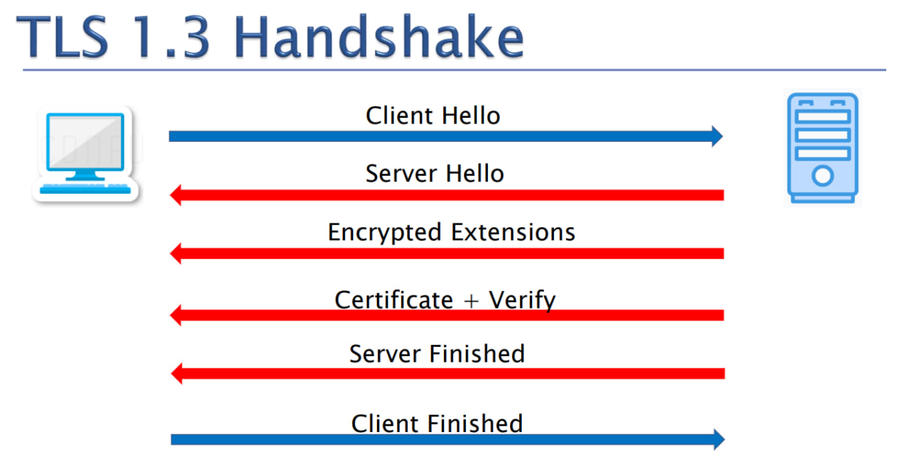

# TLS Handshake - TLS 1.3 Version



## 1. Client Hello (→)
The client initiates the handshake by sending a **Client Hello** message to the server.

### Information Sent:
- Supported TLS version
- Randomly generated number (**Client Random**)
- Supported cipher suites (encryption algorithms)
- Key Share (for key exchange)
- signature_algorithms
- Supported Extensions (e.g., ALPN, SNI, etc.)

**Wireshark Filter:**
```plaintext
tls.handshake.type == 1
```

```c
TLSv1.3 Record Layer: Handshake Protocol: Client Hello
    Content Type: Handshake (22)
    Version: TLS 1.0 (0x0301)
    Length: 2058
    Handshake Protocol: Client Hello
        Handshake Type: Client Hello (1)
        Length: 2054
        // Supported TLS version
        Version: TLS 1.2 (0x0303)
        // Randomly generated number (**Client Random**)
        Random: 85118005a6e51....
        Session ID Length: 32
        Session ID: cc74cbb37bcd6ab70fa.....
        Cipher Suites Length: 32
        // Supported cipher suites (encryption algorithms)
        Cipher Suites (16 suites)
        Compression Methods Length: 1
        Compression Methods (1 method)
        Extensions Length: 1949

        .
        .
        .

        // Key Share (for key exchange)
        Extension: key_share (len=1263) Unknown (4588), x25519
            Type: key_share (51)
            Length: 1263
            Key Share extension
                Client Key Share Length: 1261
                Key Share Entry: Group: Reserved (GREASE), Key Exchange length: 1
                Key Share Entry: Group: Unknown (4588), Key Exchange length: 1216
                Key Share Entry: Group: x25519, Key Exchange length: 32
        .
        .
        // signature algorithms
        Extension: signature_algorithms (len=18)
            Type: signature_algorithms (13)
            Length: 18
            Signature Hash Algorithms Length: 16
            Signature Hash Algorithms (8 algorithms)
                Signature Algorithm: ecdsa_secp256r1_sha256 (0x0403)
                Signature Algorithm: rsa_pss_rsae_sha256 (0x0804)
                Signature Algorithm: rsa_pkcs1_sha256 (0x0401)
                Signature Algorithm: ecdsa_secp384r1_sha384 (0x0503)
                Signature Algorithm: rsa_pss_rsae_sha384 (0x0805)
                Signature Algorithm: rsa_pkcs1_sha384 (0x0501)
                Signature Algorithm: rsa_pss_rsae_sha512 (0x0806)
                Signature Algorithm: rsa_pkcs1_sha512 (0x0601)
        .
        .
        // Supported Extensions (e.g., ALPN, SNI, etc.)
        Extension: supported_groups (len=12)
            Type: supported_groups (10)
            Length: 12
            Supported Groups List Length: 10
            Supported Groups (5 groups)
                Supported Group: Reserved (GREASE) (0x2a2a)
                Supported Group: Unknown (0x11ec)
                Supported Group: x25519 (0x001d)
                Supported Group: secp256r1 (0x0017)
                Supported Group: secp384r1 (0x0018)
        .
        .
```

---

## 2. Server Hello (←)
The server responds with a **Server Hello** message.

### Information Sent:
- Selected TLS version
- Randomly generated number (**Server Random**)
- Chosen cipher suite
- Key Share (server’s part of the key exchange)


**Wireshark Filter:**
```plaintext
tls.handshake.type == 2

```

```c
TLSv1.3 Record Layer: Handshake Protocol: Server Hello
    Content Type: Handshake (22)
    Version: TLS 1.3 (0x0304)
    Length: 80
    Handshake Protocol: Server Hello
        Handshake Type: Server Hello (2)
        Length: 76
        Version: TLS 1.3 (0x0304)
        Random: d4f23398bce73cd2950fbd7188a3a4b87ac61b02...
        Cipher Suite: TLS_AES_256_GCM_SHA384 (0x1302)
        Extensions Length: n
        Extension: Key Share
```

If the client cannot negotiate a compatible protocol version or cipher suite, the server either sends a "Handshake Failure" alert or a HelloRetryRequest. The latter is indicated by a fixed SHA-256 hash in the Server Hello's "Random" field, prompting the client to retry with adjusted key exchange parameters.
```
tls.handshake.random == CF:21:AD:74:E5:9A:61:11:BE:1D:8C:02:1E:65:B8:91:C2:A2:11:16:7A:BB:8C:5E:07:9e:09:e2:c8:a8:33:9c
```
```c
TLSv1.3 Record Layer: Handshake Protocol: Hello Retry Request
    Content Type: Handshake (22)
    Version: TLS 1.2 (0x0303)
    Length: 88
    Handshake Protocol: Hello Retry Request
        Handshake Type: Server Hello (2)
        Length: 84
        Version: TLS 1.2 (0x0303)
        // The random constant.
        Random: cf21ad74e59a6111be1d8c021e65b891c2a211167abb8c5e079e09e2c8a8339c (HelloRetryRequest magic)
        Session ID Length: 32
        Session ID: fa483917457be5a26ca524467b5b59a447d902990a4a042964e7563eb6be3491
        Cipher Suite: TLS_AES_256_GCM_SHA384 (0x1302)
        Compression Method: null (0)
        Extensions Length: 12
        Extension: supported_versions (len=2) TLS 1.3
        // The new algorithm he proposes
        Extension: key_share (len=2) secp384r1
            Type: key_share (51)
            Length: 2
            Key Share extensio
```
---

## 3. Encrypted Extensions (←)
The server sends **Encrypted Extensions**, which contain additional information that needs to remain encrypted.

### Information Sent:
- ALPN (Application Layer Protocol Negotiation)
- Server Name Indication (SNI) if used

**Wireshark Filter:**
```plaintext
tls.handshake.type == 8
```

```c
TLSv1.3 Record Layer: Handshake Protocol: Encrypted Extensions
    Content Type: Handshake (22)
    Version: TLS 1.3 (0x0304)
    Length: 64
    Handshake Protocol: Encrypted Extensions
```

---

## 4. Certificate (←)
The server sends its **digital certificate** (X.509 certificate) encrypted.

### Information Sent:
- Server's **public key**
- Certificate issuer's information
- Digital signature from a trusted Certificate Authority (CA)

**Wireshark Filter:**
```plaintext
tls.handshake.type == 11
```

```c
TLSv1.3 Record Layer: Handshake Protocol: Certificate
    Content Type: Handshake (22)
    Version: TLS 1.3 (0x0304)
    Length: 1024
    Handshake Protocol: Certificate
        Handshake Type: Certificate (11)
        Length: 1020
        Certificate Length: 1016
        Certificate: 308206d5308205bda003...
```

---

## 5. Certificate Verify (←)
The server proves its ownership of the private key corresponding to the public key in the certificate by sending a **Certificate Verify** message.

**Wireshark Filter:**
```plaintext
tls.handshake.type == 15
```

```c
TLSv1.3 Record Layer: Handshake Protocol: Certificate Verify
    Content Type: Handshake (22)
    Version: TLS 1.3 (0x0304)
    Length: 128
    Handshake Protocol: Certificate Verify
```

---

## 6. Server Finished (←)
The server sends a **Finished** message, proving that all handshake messages have been received and verified.

**Wireshark Filter:**
```plaintext
tls.handshake.type == 20
```

```c
TLSv1.3 Record Layer: Handshake Protocol: Finished
    Content Type: Handshake (22)
    Version: TLS 1.3 (0x0304)
    Length: 32
    Handshake Protocol: Finished
```

---

## 7. Client Finished (→)
The client also sends a **Finished** message, encrypted using the session key.

**Wireshark Filter:**
```plaintext
tls.handshake.type == 20
```

```c
TLSv1.3 Record Layer: Handshake Protocol: Finished
    Content Type: Handshake (22)
    Version: TLS 1.3 (0x0304)
    Length: 32
    Handshake Protocol: Finished
```

---

## Secure Communication Begins
At this point, both parties have established a secure, encrypted communication channel and can begin exchanging data securely.

---

## **Key Derivation & Session Key**
### **Steps for Key Expansion**
1. **Key Share Exchange**
   - Instead of Pre-Master Secret, TLS 1.3 uses **Ephemeral Diffie-Hellman (ECDHE)** to establish a shared secret.
2. **Master Secret Calculation**
   - The Master Secret is derived using:
     ```plaintext
     Master Secret = HKDF-Expand-Label(Shared Secret, "derived secret", Client Random + Server Random)
     ```
3. **Key Expansion**
   - From the Master Secret, session keys are derived:
     ```plaintext
     Traffic Keys = HKDF-Expand-Label(Master Secret, "traffic keys", Client Random + Server Random)
     ```
   - The session keys are then used for encryption and integrity protection.

---

## **Filtering by Specific Attributes in Wireshark**
- **Filter by TLS 1.3:**
  ```plaintext
  tls.handshake.version == 0x0304
  _ws.col.protocol == "TLSv1.3"
  ```

- **Filter by a Specific Cipher Suite:**
  ```plaintext
  tls.handshake.ciphersuite == 0x1302
  ```

- **Filter by Server Name (SNI - Example: example.com):**
  ```plaintext
  tls.handshake.extensions_server_name == "example.com"
  ```

- **Filter by a Specific Port (Example: 443):**
  ```plaintext
  tcp.port == 443
  ```

